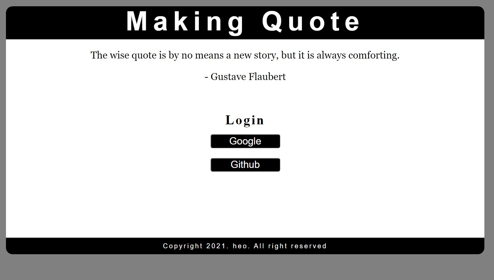
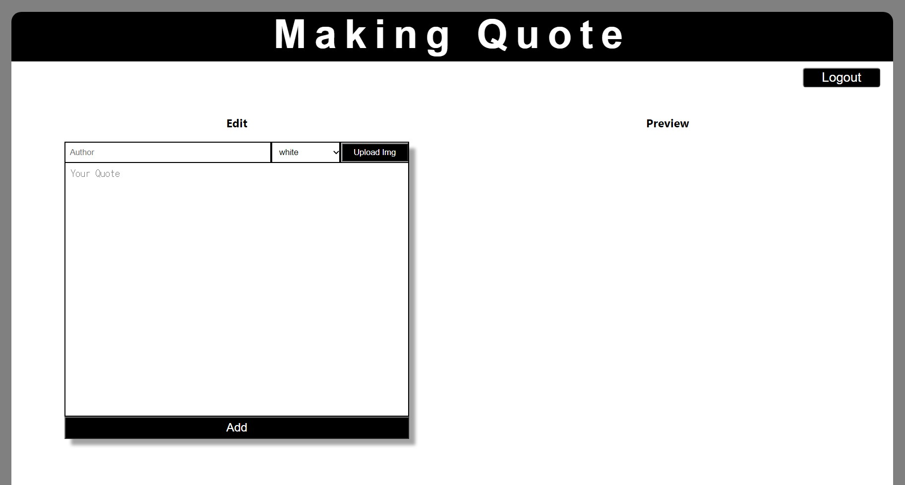
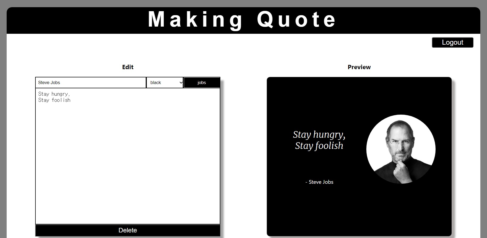

# making-quote
 
<ol>
  <li><strong>프로젝트 이름</strong> : Making Quote</li>
  <li><strong>사용 언어</strong> : HTML, CSS, JavaScript, React JS, 기타 fireBase, Cloudinary의 API </li>
  <li><strong>주요 기능</strong> 
      
    <ul>
     
<li>
      
       
      <strong>로그인: </strong>페이지 메인 화면으로, Google 혹은 Github로 사용자 로그인할 수 있습니다.</li>
        
     
      
<li>
      
       
      <strong>카드 입력 및 추가: </strong>왼쪽 화면에서 author, theme, 나타내고 싶은 quote를 작성한 뒤, 버튼을 눌러 이미지를 업로드 할 수 있습니다. 그리고 카드 하단의 Add 버튼을 눌러 명언 카드를 추가할 수 있습니다.</li>

           
          
<li>
         
             
         <strong> 카드 수정 및 실시간 미리보기 : </strong> 작성한 카드는 왼쪽 입력창을 통해 언제든지 수정할 수 있으며, 그 결과는 오른쪽 preview에 실시간으로 반영됩니다.</li>
             

       
       
        
<li><strong> 자동 저장 및 불러오기 </strong> 새로고침이나 로그아웃하더라도 작성한 카드는 그대로 저장되며, 언제든지 다시 불러올 수 있습니다.</li>
           

    </ul>
